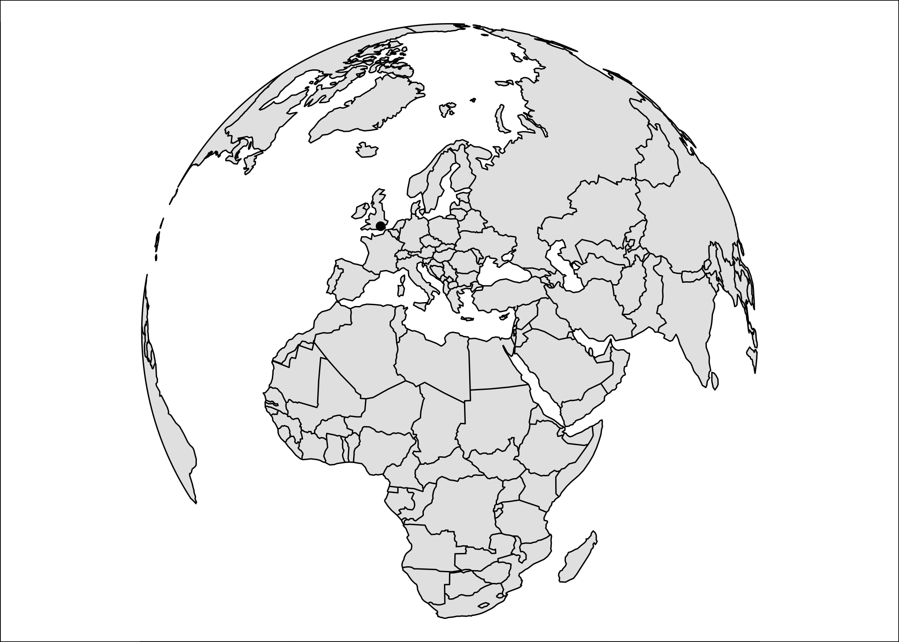
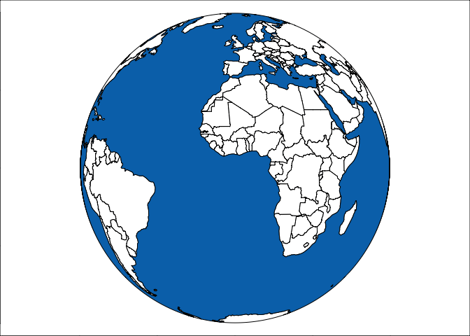

<!-- README.md is generated from README.Rmd. Please edit that file -->

# s2plot

<!-- badges: start -->

[](https://www.tidyverse.org/lifecycle/#experimental)
<!-- badges: end -->

The goal of s2plot is to provide a quick plot function for
[libs2](https://github.com/r-spatial/libs2) geographies to facilitate
development of that package.

## Installation

You can install the development version from
[GitHub](https://github.com/) with:

``` r
# install.packages("remotes")
remotes::install_github("paleolimbot/s2plot")
```

## Example

Plot libs2 geographies\!

``` r
library(s2plot)
library(libs2)

s2plot(libs2::s2data_countries(), col = "grey90")
s2plot(libs2::s2data_cities("London"), pch = 16, add = T)
```



Make a spinning globe\!

``` r
countries <- s2data_countries()
ocean <- s2_difference(
  # hack to make a polygon of the whole earth with one very tiny hole
  s2geography("POLYGON ((0 -90, 120 -90, 240 -90, 0 -90))", oriented = TRUE),
  s2_union_agg(countries)
)

lat <- 0
for (lon in seq(0, -360, length.out = 101)[-1]) {
  s2plot(
    countries, 
    col = "white", border = "black", 
    projection = s2plot_projection_orthographic(sprintf("POINT (%s %s)", lon, lat)),
    xlim = c(-1, 1),
    ylim = c(-1, 1)
  )
  
  s2plot(ocean, col = "#0073B8", add = T)
}
```


